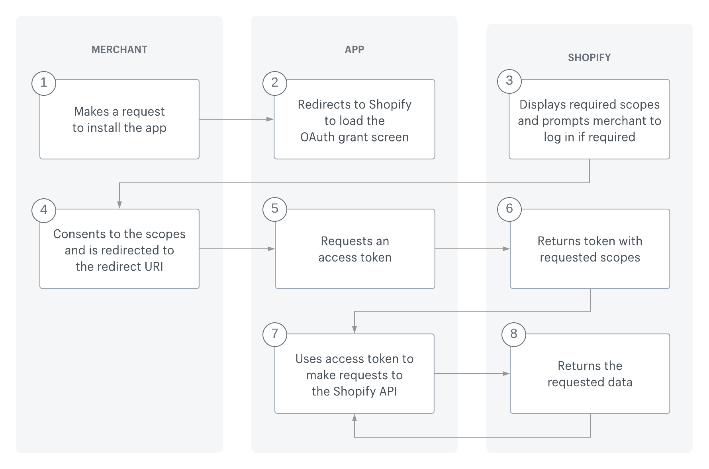

# Bet.AspNetCore.Shopify

## HMAC Validation for webhooks

[Verify the request is from Shopify](https://shopify.dev/apps/webhooks#verify-the-request-is-from-shopify)
[Verify a webhook](https://shopify.dev/apps/webhooks/configuring#verify-a-webhook)

## OAuth2 Authentication Flow

This handler supports OAuth2 authentication mechanism.

[Shopify Official Documentation](https://shopify.dev/apps/auth/oauth)

## Resources

[AspNet.Security.OAuth.Providers](https://github.com/aspnet-contrib/AspNet.Security.OAuth.Providers)
